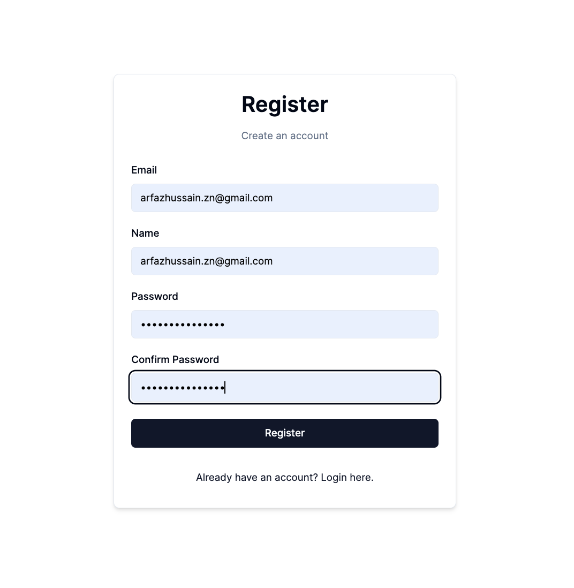
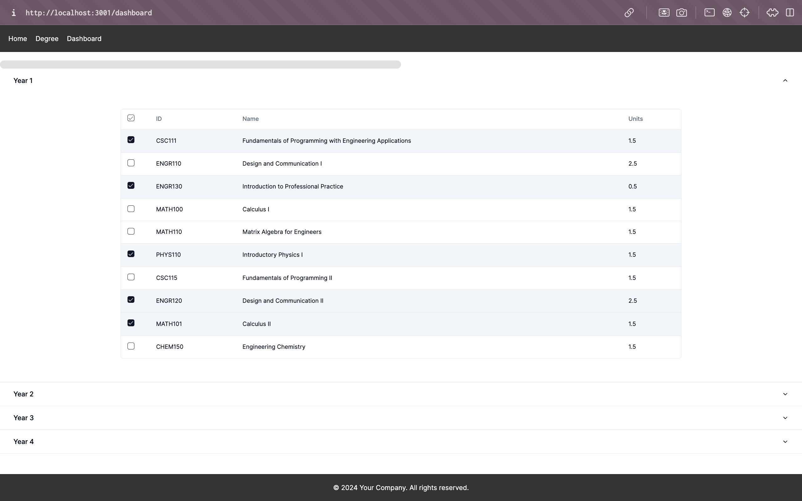
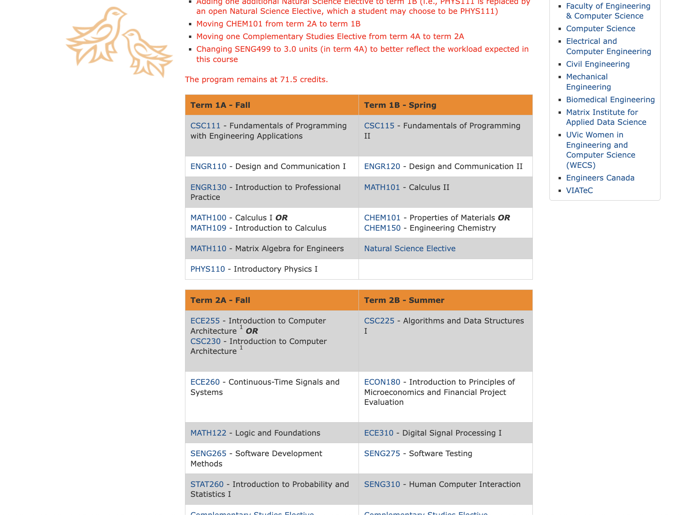

<h1>Course Progressor</h1>

Course Progressor simplifies degree planning for University of Victoria students. Leveraging NextJS, React, TailwindCSS, and Shadcn UI, it offers a streamlined interface and progress tracking features.

  
Choosing your courses:
    
  
Registration:
    
  
Courses throughout your selected degree:
    
  
Data Table Scrapped from UVic Websites for each individual courses:
    

